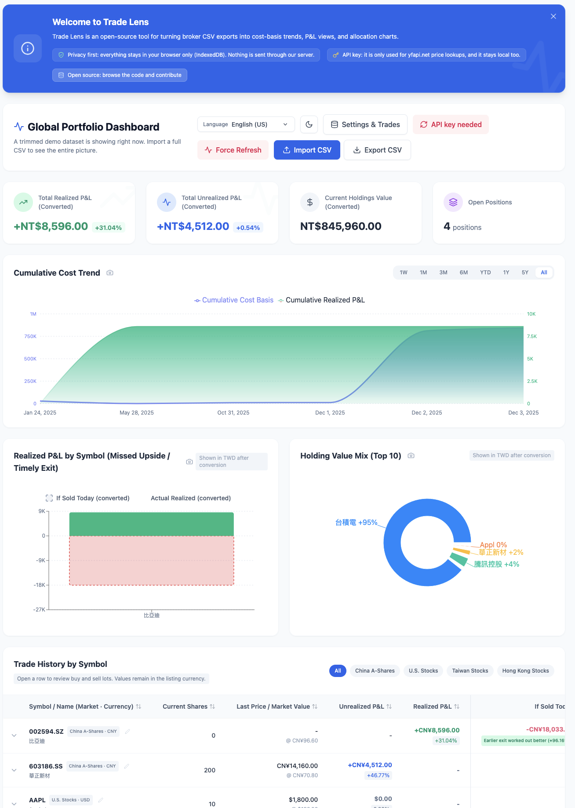

<p align="center">
  
</p>

# Trade Lens

<p align="center">
  Private portfolio analytics for investors who trade across borders.
</p>

<p align="center">
  <a href="https://git.bluesway.org/bluesway/trade-lens">繁體中文（台灣）</a>
  ·
  <a href="https://git.bluesway.org/bluesway/trade-lens/src/branch/master/README.zh-CN.md">简体中文（中国）</a>
  ·
  <a href="https://git.bluesway.org/bluesway/trade-lens/src/branch/master/README.ja-JP.md">日本語</a>
  ·
  <strong>English (US)</strong>
</p>

<p align="center">
  <a href="https://react.dev/">
    
  </a>
  <a href="https://vitejs.dev/">
    
  </a>
  <a href="https://tailwindcss.com/">
    
  </a>
  <a href="https://opensource.org/licenses/MIT">
    
  </a>
</p>

<p align="center">
  
</p>

---

## Overview

**Trade Lens** is a privacy-first trading dashboard for global stock investors. It turns brokerage CSV exports into a clean, local-first workspace for positions, cost basis, realized vs. unrealized P&L, and the brutally honest "If Sold Today" view. Your data stays in the browser, so there is no account system and no server-side trade storage.

### Highlights

- Tracks U.S., Hong Kong, Taiwan, China A-share, and Japan equities from one dashboard.
- Imports brokerage CSVs and also supports manual fills, symbol naming fixes, and current price overrides.
- Uses `yfapi.net` for live quotes and FX conversion.
- Includes multilingual UI support, dark mode, and responsive layouts.
- Compares actual exits with "If Sold Today" outcomes so you can spot disciplined risk management versus missed upside.

### What It Helps With

- Pull trade records from multiple brokers and markets into one review workflow.
- Review holdings, cost basis, unrealized P&L, and realized P&L without spreadsheet chaos.
- Revisit exit timing through an "If Sold Today" lens instead of guessing from memory.
- Keep sensitive trading data local when you do not want it sitting in someone else's cloud.

### Quick Start

1. Clone the repository
   ```bash
   git clone https://git.bluesway.org/bluesway/trade-lens.git
   cd trade-lens
   ```
2. Install dependencies
   ```bash
   npm install
   ```
3. Start the development server
   ```bash
   npm run dev
   ```
4. Add your `yfapi.net` API key in the manager panel, then import a brokerage CSV.

## Tech Stack

- React 18
- Vite
- Tailwind CSS
- Recharts
- i18next / react-i18next
- IndexedDB

## License

Distributed under the **MIT License**. See [`LICENSE`](https://git.bluesway.org/bluesway/trade-lens/src/branch/master/LICENSE) for details.
