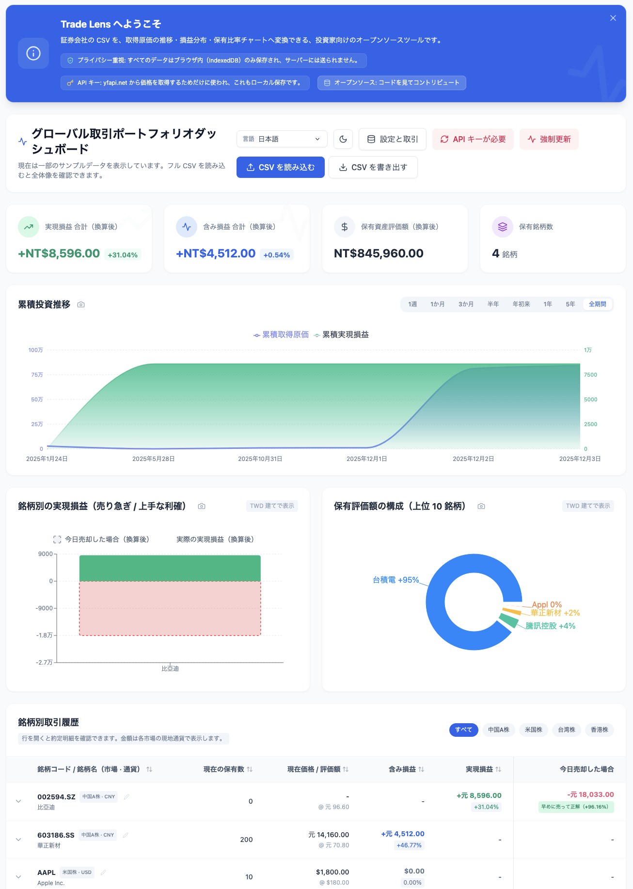

<p align="center">
  
</p>

# Trade Lens

<p align="center">
  グローバル株の売買を、ローカル環境で安全に振り返れるプライバシー重視ダッシュボード。
</p>

<p align="center">
  <a href="https://github.com/bluesway/trade-lens">繁體中文（台灣）</a>
  ·
  <a href="https://github.com/bluesway/trade-lens/blob/master/README.zh-CN.md">简体中文（中国）</a>
  ·
  <strong>日本語</strong>
  ·
  <a href="https://github.com/bluesway/trade-lens/blob/master/README.en-US.md">English (US)</a>
</p>

<p align="center">
  <a href="https://react.dev/">
    
  </a>
  <a href="https://vitejs.dev/">
    
  </a>
  <a href="https://tailwindcss.com/">
    
  </a>
  <a href="https://opensource.org/licenses/MIT">
    
  </a>
</p>

<p align="center">
  
</p>

---

## 概要

**Trade Lens** は、プライバシー重視で設計されたグローバル株式向けの取引ダッシュボードです。証券会社の CSV を読み込むだけで、保有状況、取得原価の推移、損益分布、さらに「今日売却した場合」の比較分析までまとめて可視化できます。データはブラウザ内だけに保存され、サーバーへ送信されません。

### 特長

- 米国株、香港株、台湾株、中国 A 株、日本株をひとつの画面でまとめて確認できます。
- 証券会社 CSV の取り込みに加え、取引の手入力、銘柄名の修正、現在値の上書きにも対応しています。
- `yfapi.net` を使って株価と為替を更新。
- 多言語 UI、ダークモード、モバイル表示に対応。
- 「今日売却した場合」と実際の実現損益を比べて、利確が上手かったのか、早売りだったのかを振り返りやすく表示します。

### こんなときに役立ちます

- 複数の証券会社や市場に散らばった取引履歴を、一つの画面にまとめて見たい。
- 現在の保有、取得コスト、含み損益、実現損益を素早く把握したい。
- 「今日売っていたら」を基準に、自分の出口判断を振り返りたい。
- 取引データをクラウドへ預けずに、手元でしっかり分析したい。

### はじめ方

1. リポジトリを取得
   ```bash
   git clone https://github.com/bluesway/trade-lens.git
   cd trade-lens
   ```
2. 依存関係をインストール
   ```bash
   npm install
   ```
3. 開発サーバーを起動
   ```bash
   npm run dev
   ```
4. 管理パネルで `yfapi.net` の API キーを設定し、証券会社の CSV を読み込んでください。

## 技術スタック

- React 18
- Vite
- Tailwind CSS
- Recharts
- i18next / react-i18next
- IndexedDB

## ライセンス

本プロジェクトは **MIT License** の下で提供されています。詳細は [`LICENSE`](https://github.com/bluesway/trade-lens/blob/master/LICENSE) をご確認ください。
