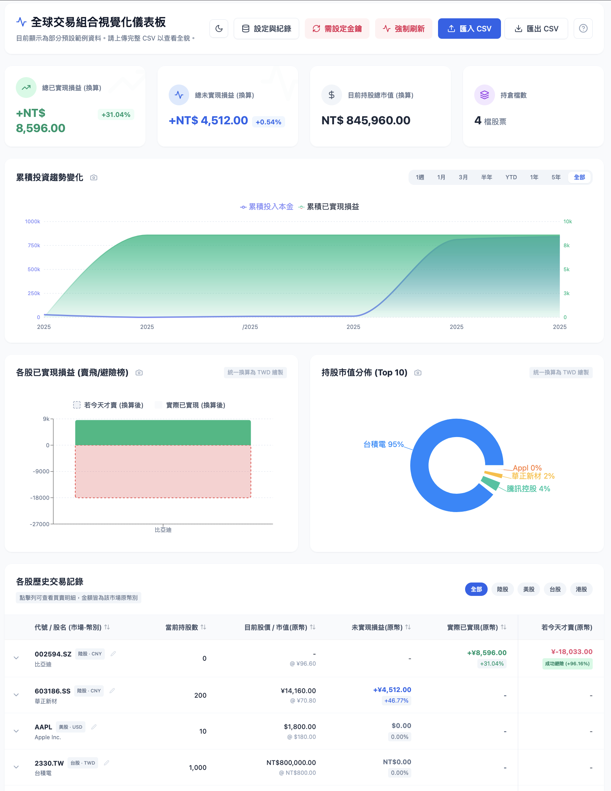

# 📊 Trade Lens: Global Portfolio Insights

[](https://reactjs.org/)
[](https://vitejs.dev/)
[](https://tailwindcss.com/)
[](https://opensource.org/licenses/MIT)



**Trade Lens** is a professional-grade, privacy-first trading dashboard designed for the modern investor. It transforms your raw brokerage CSV exports into beautiful, actionable visualizations—all while keeping your sensitive financial data exactly where it belongs: **on your own device.**

---

## ✨ Key Features

-   **🔒 Privacy-First Architecture**: No accounts, no servers, no tracking. Your trade data is stored locally in your browser's **IndexedDB**.
-   **📈 Global Market Support**: Track stocks across US, HK, TW, SZ/SS, and JP markets seamlessly.
-   **📊 Smart CSV Import**: Intelligent parser that recognizes various brokerage formats and maps them to a unified dashboard.
-   **⚡ Real-time Quotes**: Integrated with Yahoo Finance API (via `yfapi.net`) for up-to-date pricing and automated currency conversion.
-   **💸 "Regret" Analysis (If Sold Today)**: A unique feature that compares your actual realized P&L with what it would have been if you held until today. Perfectly identify "paper hands" vs. "diamond hands" moments.
-   **📱 Fully Responsive**: A polished UI that works beautifully on desktops, tablets, and mobile phones with native-like dark mode support.

## 🚀 Getting Started

### Prerequisites
-   A free API key from [yfapi.net](https://financeapi.net/) (for real-time quotes).
-   Your trade history exported as a CSV file.

### Installation
1.  Clone the repository:
    ```bash
    git clone https://github.com/yourusername/trade-lens.git
    cd trade-lens
    ```
2.  Install dependencies:
    ```bash
    npm install
    ```
3.  Start the development server:
    ```bash
    npm run dev
    ```

## 🛠 Tech Stack

-   **Frontend**: React 18 (Hooks, Context API)
-   **Styling**: Tailwind CSS
-   **Charts**: Recharts
-   **Icons**: Lucide React
-   **Data Persistence**: IndexedDB (Browser Native)
-   **Build Tool**: Vite

## 🔐 Security & Privacy

We take your financial privacy seriously:
-   **Data Sovereignty**: Your trade records never leave your browser.
-   **API Safety**: Your `yfapi.net` key is stored only in your local storage.
-   **No Analytics**: We do not use Google Analytics or any third-party tracking scripts.

## 📄 License

Distributed under the **MIT License**. See `LICENSE` for more information.

---

*Built with ❤️ for investors who value their privacy.*
