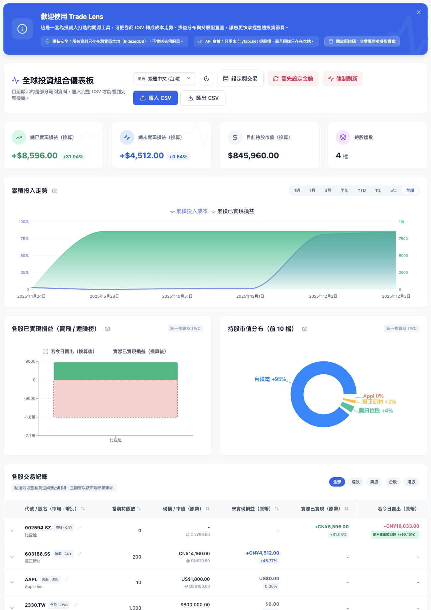

<p align="center">
  
</p>

# Trade Lens

<p align="center">
  隱私優先的全球股票交易儀表板，把券商 CSV 變成看得懂的持股全貌。
</p>

<p align="center">
  <strong>繁體中文（台灣）</strong>
  ·
  <a href="https://github.com/bluesway/trade-lens/blob/master/README.zh-CN.md">简体中文（中国）</a>
  ·
  <a href="https://github.com/bluesway/trade-lens/blob/master/README.ja-JP.md">日本語</a>
  ·
  <a href="https://github.com/bluesway/trade-lens/blob/master/README.en-US.md">English (US)</a>
</p>

<p align="center">
  <a href="https://react.dev/">
    
  </a>
  <a href="https://vitejs.dev/">
    
  </a>
  <a href="https://tailwindcss.com/">
    
  </a>
  <a href="https://opensource.org/licenses/MIT">
    
  </a>
</p>

<p align="center">
  
</p>

---

## 產品介紹

**Trade Lens** 是一套隱私優先的全球股票交易儀表板，能把券商 CSV 轉成持股總覽、成本曲線、損益分布，連那種一看就會心頭一震的「若今日賣出」復盤分析也一起算給你看。資料全程只留在你的瀏覽器，不需要註冊，也不用把交易紀錄交給別人的伺服器保管。

### 特色

- 支援美股、港股、台股、陸股與日股，同一個畫面一起看。
- 可匯入券商 CSV，也能手動補單、改股名、覆蓋最新價格。
- 串接 `yfapi.net` 取得即時股價與匯率換算。
- 內建多語系介面、深色模式與手機友善排版。
- 用「若今日賣出」對照實際已實現損益，一眼看出到底是賣飛還是風險控得漂亮。

### 快速開始

1. 複製專案
   ```bash
   git clone https://github.com/bluesway/trade-lens.git
   cd trade-lens
   ```
2. 安裝依賴
   ```bash
   npm install
   ```
3. 啟動開發環境
   ```bash
   npm run dev
   ```
4. 在管理面板貼上 `yfapi.net` API 金鑰，然後匯入你的 CSV。

### 你會拿它來幹嘛

- 把散在不同券商或市場的交易紀錄，拉回同一個畫面統一看。
- 快速看懂目前持股、持有成本、未實現損益與已實現損益。
- 用「若今日賣出」的角度回頭看自己是神逃頂，還是只是提早下車。
- 不想把敏感交易資料丟上雲端時，照樣能做出像樣的投資復盤。

### 其他語言文件

- 简体中文（中国）：[`README.zh-CN.md`](https://github.com/bluesway/trade-lens/blob/master/README.zh-CN.md)
- 日本語：[`README.ja-JP.md`](https://github.com/bluesway/trade-lens/blob/master/README.ja-JP.md)
- English (US)：[`README.en-US.md`](https://github.com/bluesway/trade-lens/blob/master/README.en-US.md)

## 技術組成

- React 18
- Vite
- Tailwind CSS
- Recharts
- i18next / react-i18next
- IndexedDB

## 授權條款

本專案採 **MIT License** 授權，詳見 [`LICENSE`](https://github.com/bluesway/trade-lens/blob/master/LICENSE)。
