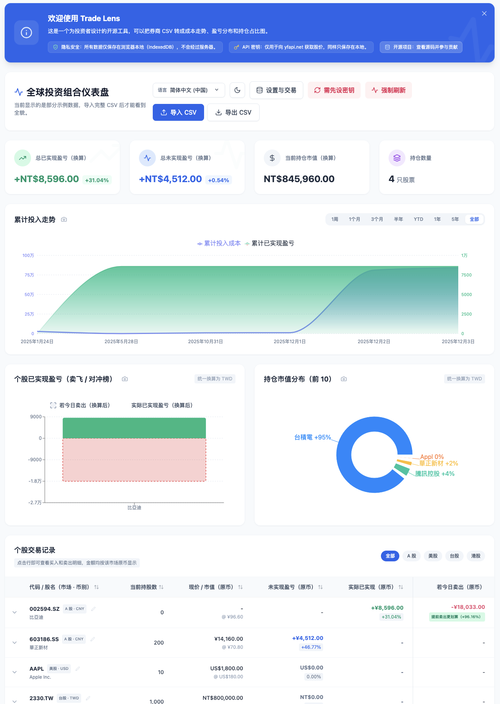

<p align="center">
  
</p>

# Trade Lens

<p align="center">
  面向全球股票投资者的隐私优先交易仪表盘。
</p>

<p align="center">
  <a href="README.md">繁體中文（台灣）</a>
  ·
  <strong>简体中文（中国）</strong>
  ·
  <a href="README.ja-JP.md">日本語</a>
  ·
  <a href="README.en-US.md">English (US)</a>
</p>

<p align="center">
  <a href="https://react.dev/">
    
  </a>
  <a href="https://vitejs.dev/">
    
  </a>
  <a href="https://tailwindcss.com/">
    
  </a>
  <a href="https://opensource.org/licenses/MIT">
    
  </a>
</p>

<p align="center">
  
</p>

---

## 产品介绍

**Trade Lens** 是一款以隐私为优先的全球股票交易仪表盘，可以把券商 CSV 转成持仓总览、成本走势、盈亏分布，以及“如果今天卖出”的复盘视角。所有数据都只保留在浏览器本地，不需要注册，也不会把交易记录上传到服务器。

### 特性

- 支持美股、港股、台股、中国 A 股和日股。
- 可导入券商 CSV，也支持手动补录、修改股票名称和最新价格。
- 接入 `yfapi.net` 获取实时股价与汇率换算。
- 内建多语言界面、深色模式与移动端适配。
- 通过“如果今天卖出”对照实际已实现盈亏，快速判断是卖飞了还是对冲到位。

### 适合拿来做什么

- 把不同券商、不同市场的交易记录收拢到同一套面板里。
- 快速查看当前持仓、持仓成本、浮动盈亏和已实现盈亏。
- 从“如果今天卖出”的角度复盘自己的离场时机。
- 在不想上传敏感交易数据的前提下，依然做完整的投资分析。

### 快速开始

1. 克隆仓库
   ```bash
   git clone https://git.bluesway.org/bluesway/trade-lens.git
   cd trade-lens
   ```
2. 安装依赖
   ```bash
   npm install
   ```
3. 启动开发环境
   ```bash
   npm run dev
   ```
4. 在管理面板填入 `yfapi.net` API Key，然后导入你的 CSV。

## Tech Stack

- React 18
- Vite
- Tailwind CSS
- Recharts
- i18next / react-i18next
- IndexedDB

## License

Distributed under the **MIT License**. See [`LICENSE`](LICENSE) for details.
